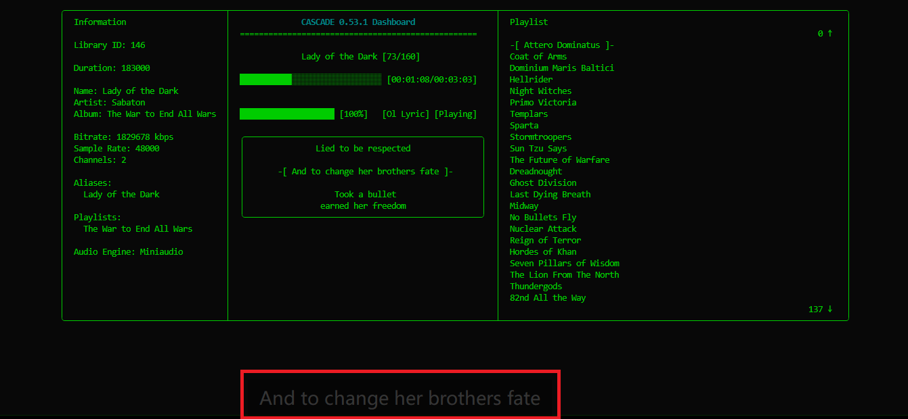
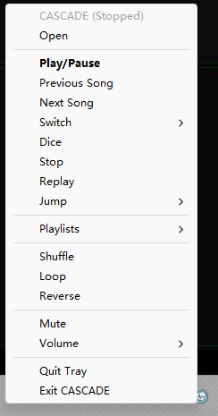
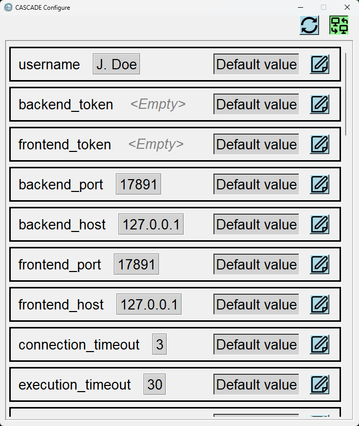

# CASCADE

**C**ommand-Line **A**udio **S**tream **C**apture **A**nd **D**ecoding **E**ngine


Retrieves collections of mechanically-represented wave data from persistent storage, decompartmentalizes their format-specific encapsulation, reconstitutes the original waveform through algorithmic reconstruction, and transmits the resulting signal to a computer-connected mechanical wave generator. Controlled via a teletype-like interactive interface. Supports automatic transition to the next data set or the beginning of the current data set upon completion, based on a configured mode.

(CLI music player. Lives in the terminal.)

---

This is my biggest and best project so far. Check out my other repos and you'll see why. I wanted to build something with a separate backend-frontend structure, then I came up with the music player idea. 

The original name of this project was CADENCE, which stands for **C**ommand-line **A**udio **D**ecoding **E**gine with **N**avigation and **C**ontinuous **E**xecution, but later I realized there's already another Cadence on the market. So I was forced to change the name into what it is now, even though the other Cadence name isn't nearly as cool as mine.

I'm not a professional programmer, and programming is more of a hobby to me. Don't hold back on any kind of feedback!

P.S. I'm not from an English-speaking country, so feel free to give feedback on my English too.

---

## Highlights

- Daemon backend running in the background - control your playback across terminals
- Automatic online lyrics
- Remote control
- Choose from TWO audio engines: VLC / miniaudio

[Full features](./docs/Features.md)

## Dependencies

- Python 3.12+
- VLC media player (already included in releases)
- [Third-party packages](requirements.in)

## Installation

### Pip

```bash
pip install git+https://github.com/askformeal/CASCADE.git
```

### Build from source

```bash
bash build.sh          # on Windows: from git-bash
```

**I never spent much effort on the building script, so I recommend pip.**

---

**For more information, check out [the document](docs/Index.md).**

## Screenshots

### Dashboard TUI
```
╭──────────────────────────────────────┬────────────────────────────────────────────────────────┬─────────────────────────────────────────────────────────────────────────╮
│  Information                         │               CASCADE 0.54.0 Dashboard                 │  Playlist                                                               │
│                                      │  ==================================================    │                                                                   0 ↑   │
│  Library ID: 16                      │                                                        │  > -[ Attero Dominatus ]- <                                             │
│                                      │               Attero Dominatus [1/160]                 │  Coat of Arms                                                           │
│  Duration: 00:03:43                  │                                                        │  Dominium Maris Baltici                                                 │
│                                      │  ████░░░░░░░░░░░░░░░░░░░░░░░░░░ [00:00:29/00:03:43]    │  Hellrider                                                              │
│  Name: Attero Dominatus              │                                                        │  Night Witches                                                          │
│  Artist: Sabaton                     │                                                        │  Primo Victoria                                                         │
│  Album: Attero Dominatus (Re-Armed)  │  ████████████████████ [100%]    [Ol Lyric] [Paused]    │  Templars                                                               │
│                                      │                                                        │  Sparta                                                                 │
│  Bitrate: 1051.179 kbps              │  ╭──────────────────────────────────────────────────╮  │  Stormtroopers                                                          │
│  Sample Rate: 44100                  │  │                     Interimo!                    │  │  Sun Tzu Says                                                           │
│  Channels: 2                         │  │                                                  │  │  The Future of Warfare                                                  │
│                                      │  │            -[ The reich has fallen ]-            │  │  Dreadnought                                                            │
│  Aliases:                            │  │                                                  │  │  Ghost Division                                                         │
│    Attero Dominatus                  │  │          We stand at the gates of Berlin         │  │  Last Dying Breath                                                      │
│                                      │  │          With two and a half million men         │  │  Midway                                                                 │
│  Playlists:                          │  ╰──────────────────────────────────────────────────╯  │  No Bullets Fly                                                         │
│    Attero Dominatus                  │  Play/Pause                                            │  Nuclear Attack                                                         │
│                                      │                                                        │                                                                 143 ↓   │
│  Audio Engine: Miniaudio             │                                                        │                                                                         │
╰──────────────────────────────────────┴────────────────────────────────────────────────────────┴─────────────────────────────────────────────────────────────────────────╯
```

*Yep, that's Sabaton right there*

### Floating lyric



### System tray



### Configure GUI



## Known issues

When open a playlist from tray icon and there's a song of the same name in the library, the song will be opened instead.

## TODO

See [TODO.md](TODO.md) for planned features.

## Credits

Icon: [Cadence icons created by Three musketeers - Flaticon](https://www.flaticon.com/free-icon/musical_16496971)

Lyric icon: [Lyrics icons created by Aranagraphics - Flaticon](https://www.flaticon.com/free-icon/document_10305758)

Cover placeholder: [Image-placeholder icons created by Graphics Plazza - Flaticon](https://www.flaticon.com/free-icon/image_9261181)

Uicons by [Flaticon](https://www.flaticon.com/uicons)

## License

MIT License, because using it is your loss :)
